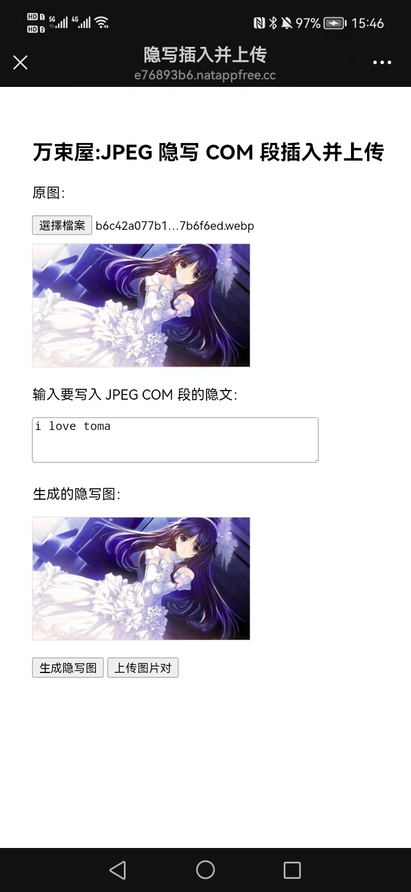
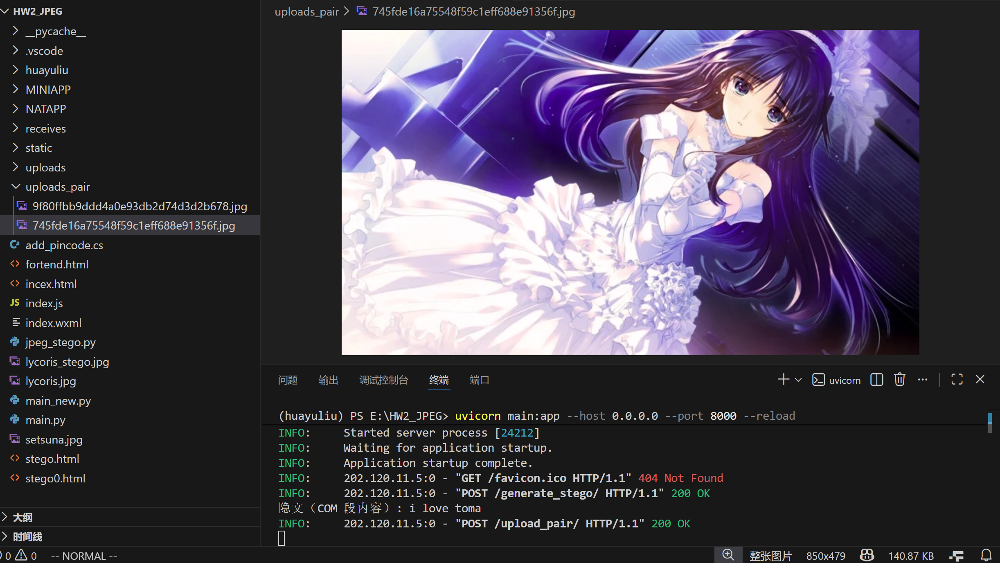

# JPEG COM 段隐写与解析 Demo（FastAPI + HTML 前端）

这是我的网络安全课程小项目，内容是利用 **JPEG 的 COM 段** 实现简单的隐写与解析。  
项目包含一个基于 **FastAPI** 的后端，以及几个用于上传图片 / 生成隐写图片的前端页面。

> ⚠️ 本项目仅用于课程作业与技术学习，不能用于生产或安全敏感环境。

---

## ✨ 功能介绍

### ✔ 将文本隐写插入 JPEG 的 COM 段  
用户上传一张 JPEG 图片，并输入要写入的隐藏文本，后端会自动向 JPEG 注入一个 COM 段，并生成带隐写信息的新图。

### ✔ 解析上传图片中的 COM 段内容  
上传包含 COM 段的 JPEG，后端会解析 COM 内容并返回给前端显示。

### ✔ 前端展示原图与隐写结果  
使用简单的 HTML 页面展示选择图片、输入文本、生成隐写图、上传图片对比等功能。

---

## 📁 项目结构说明

为了便于你了解本项目的目录结构，下方列出了主要的文件与用途（项目本身比较乱，这里做了简化说明）：

HW2_JPEG/
│
├── main.py # FastAPI 主后端文件（生成隐写图、解析上传图片）
├── main_new.py # 另一版后端（测试用）
│
├── jpeg_stego.py # JPEG COM 段插入与解析核心逻辑
│
├── static/ # 前端静态资源
├── front_end.html # 隐写前端页面
├── stego.html # 隐写生成页面
├── indexx.html # 上传图片对解析页面
│
├── uploads/ # 接收生成的隐写图片
├── uploads_pair/ # 接收成对上传的图片（作业第二部分）
│
├── receives/ # 保存前后端转发测试图片
│
├── NATAPP/ # 内网穿透工具 natapp 的配置文件
│
├── lycoris_stego.jpg # 示例隐写图
├── setsuna.jpg # 示例原图
│
└── 其他用于第一次作业的 JS / 小程序文件

yaml
Copy code

---

## 🖼️ Demo 截图展示

### 1. 前端：选择原图并输入隐藏文本  


### 2. 解析后的弹窗提示  


### 3. 后端收到上传请求  


### 4. 使用十六进制编辑器查看 COM 段中的隐写内容  


---

## 🚀 启动方式

### 1. 安装依赖
```bash
pip install fastapi uvicorn pillow
2. 启动后端
bash
狂欢
Copy code
uvicorn main:app --host 0.0.0.0 --port 8000 --reload
3. 访问前端页面
将浏览器打开：

bash
狂欢
Copy code
http://localhost:8000/stego.html
🛠️ 实现原理简述
JPEG 结构中允许加入 COM（Comment）段：

COM 标记为：FF FE

后跟 2 字节长度字段

再后面是注入的内容（字节）

本项目：

使用 Python 读取 JPEG 文件二进制流

在 SOI（FF D8）之后插入一个 COM 段

将用户输入的文本直接写入其中

再输出新的 JPEG 文件

解析时则扫描 JPEG 字节流，找到 FF FE 段并提取内容。

📌 注意事项
COM 段是明文，可被抓包、可被十六进制编辑器轻松查看

不适合作为真正的隐写技术

浏览器若将 WebP 自动转成 JPEG，COM 结构可能丢失

本项目用于教学，不涉及攻防安全

🏁 License🏁 许可证
MIT LicenseMIT 许可证
自由学习使用。
